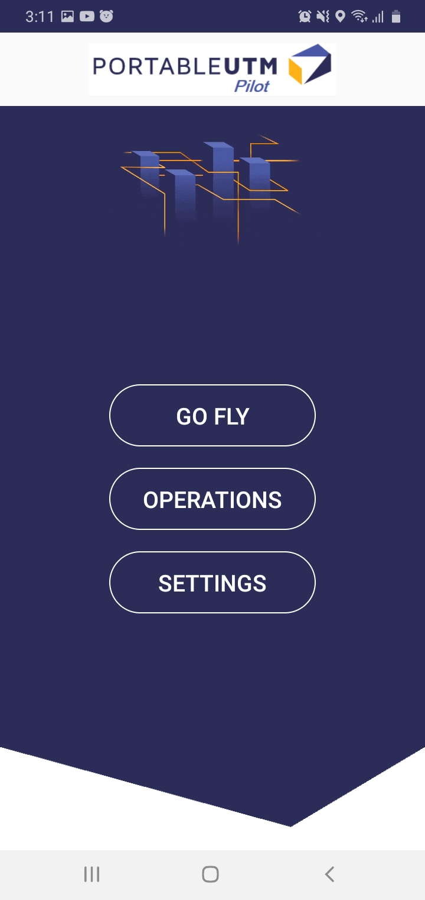
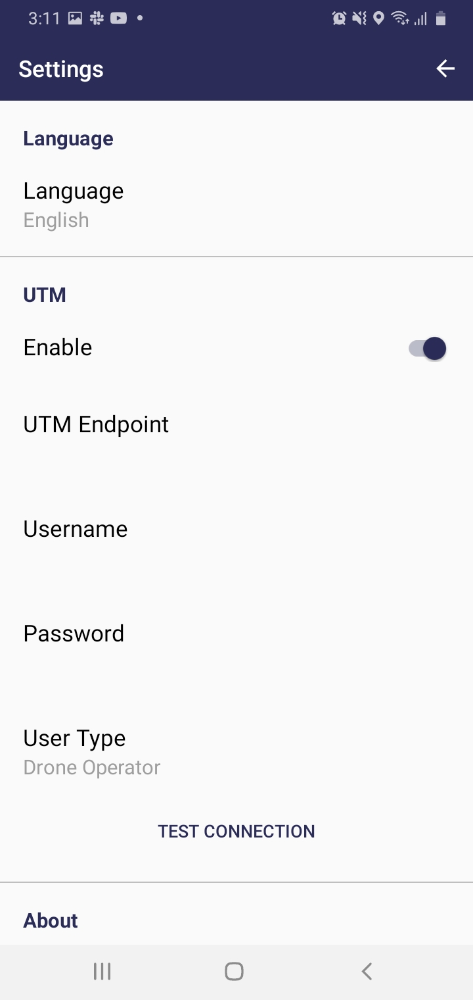
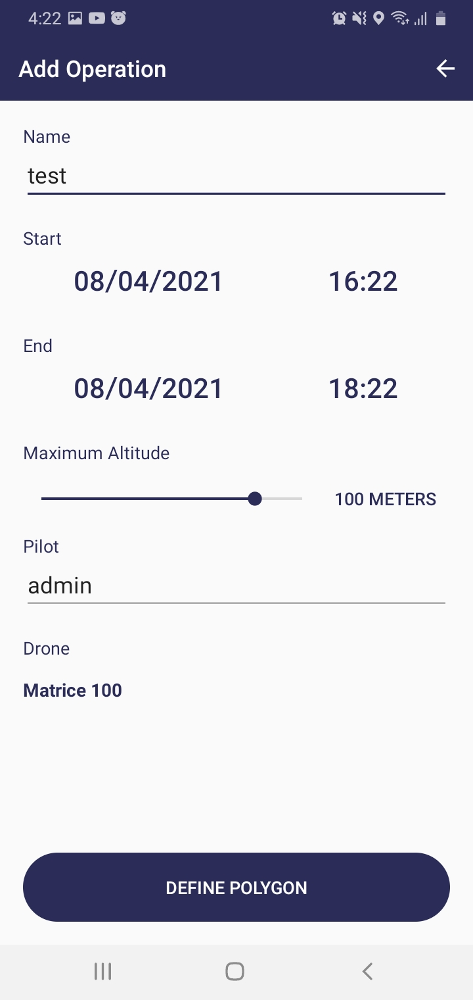
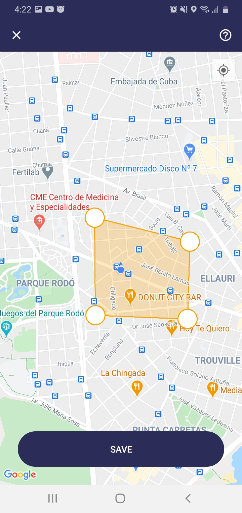
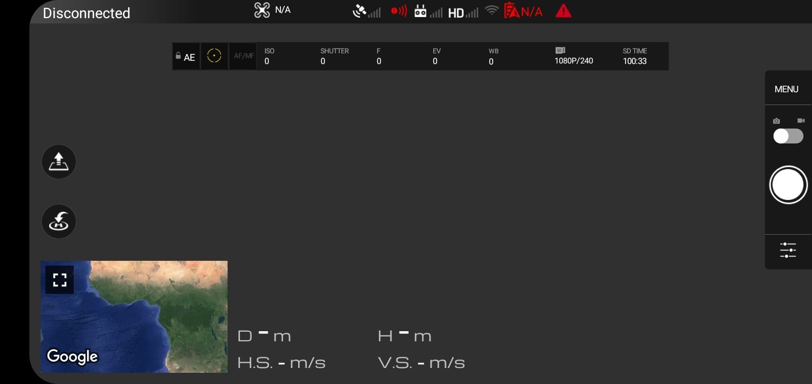

# Portable UTM Pilot

> Here you will find how to use Portable UTM Pilot

---

### Table of Contents
You're sections headers will be used to reference location of destination.

- [Description](#description)
- [How To Use](#how-to-use)
- [License](#license)
- [Author Info](#author-info)

---

## Description

Portable UTM Pilot is a mobile app for drone pilots, to let them fly their drones connected to Portable UTM. With Portable UTM Pilot, pilots will be able to reserve the airspace they want to use (before using it), and then fly reporting position in real time to Portable UTM.

Currently the application is only developed for Android, and to be connected to DJI drones.

#### Technologies

- Java
- Android SDK
- DJI Mobile SDK

---

## How To Use
### Main Screen

On the main screen we will see 3 options:
* Go Fly: To fly the drone.
* Operations: To see the airspace reservations we have, and make new reservations.
* Settings: To configure different options that the application has.

### Settings

Here we can configure the language and the connection with Portable UTM. First of all we have a switch to indicate whether or not we want to fly connected to the UTM. In case of enabling this option, we must configure the endpoint in which the UTM is hosted, as well as our access credentials.

### Add Operation
 

In order to make a new airspace reservation, first we must go to the operations view, and then we press the button that is located at the bottom right. We will see a screen in which we can give our operation a name, as well as define from and until when we are going to fly, the maximum height in meters, the name of the pilot, and the drone that we are going to use.

Then, we touch "Define Polygon", and we will see another view where we will be able to draw the polygon within which we are going to fly.

### Fly

To fly the drone, select the option "Go Fly" on the main screen. If we have enabled and well configured the connection with the UTM in the settings part, the application will ask us if we want to report position in real time to the UTM. If the answer is yes, it will show us the list of operations that we have, and we must choose between them in which operation we intend to fly.

In any case, it must be clarified that the application can be used without being connected to the UTM.

---

## License

MIT License

Copyright (c) [2021] [Dronfies Labs]

Permission is hereby granted, free of charge, to any person obtaining a copy
of this software and associated documentation files (the "Software"), to deal
in the Software without restriction, including without limitation the rights
to use, copy, modify, merge, publish, distribute, sublicense, and/or sell
copies of the Software, and to permit persons to whom the Software is
furnished to do so, subject to the following conditions:

The above copyright notice and this permission notice shall be included in all
copies or substantial portions of the Software.

THE SOFTWARE IS PROVIDED "AS IS", WITHOUT WARRANTY OF ANY KIND, EXPRESS OR
IMPLIED, INCLUDING BUT NOT LIMITED TO THE WARRANTIES OF MERCHANTABILITY,
FITNESS FOR A PARTICULAR PURPOSE AND NONINFRINGEMENT. IN NO EVENT SHALL THE
AUTHORS OR COPYRIGHT HOLDERS BE LIABLE FOR ANY CLAIM, DAMAGES OR OTHER
LIABILITY, WHETHER IN AN ACTION OF CONTRACT, TORT OR OTHERWISE, ARISING FROM,
OUT OF OR IN CONNECTION WITH THE SOFTWARE OR THE USE OR OTHER DEALINGS IN THE
SOFTWARE.

---

## Author Info

- Dronfies Labs - [dronfies.com](https://dronfies.com/)